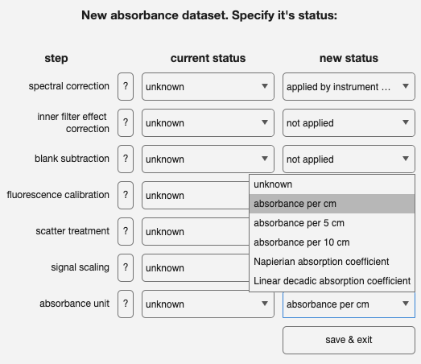

 

# importabsorbance
Import absorbance measurement files and create drEEMdataset object

## Syntax
[`dataout = importabsorbance(filePattern)`](#syntax1)

[`dataout = importabsorbance( ___ , Name,Value)`](#syntax2)

## Description

This function scans the current working directory (`pwd`) for absorbance files using a given filename pattern, reads each file, and returns a `drEEMdataset` containing the absorbance data.

The function does two passes of imports. The first is used to read the dimensions of each file and to subsequently check that all data contains the same wavelength information.

> ***All files must contain the same wavelength information. If this is not the case, the function will attempt to resolve the issue but most likely return an error!***

Upon successful import, the `changestatus` GUI will appear on screen and pause the execution until the user has acknowledged the status of the dataset. You are asked to specify to what level the dataset has been processed. Since the drEEMdataset can contain fluorescence and / or absorbance, the GUI will ask about fluorescence properties. Please ignore these and focus on the property `absorbance unit`.

> ***Take care to specify the correct pathlength in the GUI. If an incorrect pathlength or absorbance unit is specified, the IFE correction will not be accurate.***

 

> ***The GUI must be exited by clicking on "save & exit". Otherwise, the import will be cancelled and no dataset will be created.***

<b>
`dataout = importabsorbance(filePattern)` - standard options (fits HYJ Export for AquaLog data)</b>

 
returns a drEEMdataset class object that contains absorbance spectra and   their associated information.

<b>
`dataout = importabsorbance([ ___ ], Name,Value)` - custom options</b>

Custom options are specifed with optional pairs of arguments using one or more name-value arguments. For example, you can specify the column number that holds the wavelength data or the column that holds the absorbance data.

## Examples

<strong>Horiba AquaLog exported .dat-files:</strong>

`absorbance = tbx.importabsorbance(" - Abs Spectra Graphs.dat");`
      
<strong>csv-export of data from spectrophotometer software:</strong>

`absorbance = tbx.importabsorbance(".csv",waveColumn=1,absColumn=2);`

## Input arguments

    
<b>`filePattern ` Text pattern to identify files for import</b>

    <i>char | string</i>
        
A text specifying the pattern of the files to be imported. This can include wildcard characters (*) to match multiple files. The pattern will be completely removed from the sample name after import to leave only the non-repeating filename information. For example `S001ABS.dat` will be known as `S001` in the produced dataset.

Examples:

* `'*.csv'`
* `'* - Abs Spectra Graphs.dat'`

## Name-Value arguments
Specify pairs of arguments as `Name1=Value1,...,NameN=ValueN`, where `Name` is the argument name and `Value` is the corresponding value. The notation `"Name",Value` is also supported. Name-value arguments must appear after other arguments, `data` in this case, but the order of the pairs does not matter. 

    
<b>`waveColumn`- which column of data contains wavelength data</b>

    <i>numeric</i>
    
The wavelength data in the measurement files are expected to be found in the specified column. Default is column `1`. 

Example: `'columnWave', 1` if the first column contains the wavelength information.

Default is `1`.

    
<b>`AbsorbanceColumn `- which column of data contains absorbance data data</b>

    <i>numeric</i>

Specify which column of data in the measurement files contains the absorbance data. 

Default is column `10`.

Example: `'AbsorbanceColumn', 10` if the tenth column contains the absorbance data.
    

    
<b>`NumHeaderLines `- number of header lines to ignore</b>

    <i>numeric</i>

Specify the number of  lines (rows) to skip from the top in each file. Default is `0`. 

Example: `'NumHeaderLines', 2` to remove the first 2 rows of each file 

Default is `0`.

## Output arguments

    
<b>`data` - contains CDOM spectra </b>

    <i>drEEMdataset</i>
        
A dataset of the class `drEEMdataset` that passes the validation function `tbx.validatedataset(dataout)`.
The absorbance data is stored using the properties `.abs`, `.absWave`, and sample names are stored in `.filelist`. Read the documentation on the `drEEMdataset` for more information.

