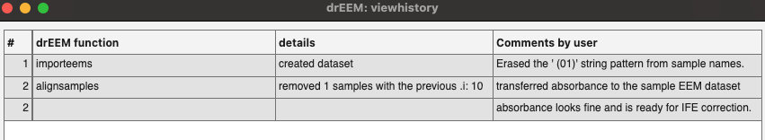
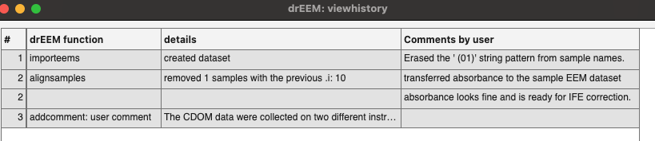

# addcomment
Document an analysis process through comments.

## Syntax

[`dataout = addcomments(data,comment)`](#s1)

[`dataout = addcomments(data,comment,'newline')`](#s2)

## Description
`dataout = addcomments(data,'new comment here')`  adds a comment to a drEEMdataset that describes an observation, justifies a decision, or documents any other kind of process. The comment field will be stored in the document's history and can be retreived with [`viewistory`](viewhistory.hmtl) and [`displayhistory`](displayhistory.hmtl) and will be exported with [`exportresults`](exportresults.hmtl) and [`export2zip`](export2zip.hmtl). 

By default, the function assumes that a comment is being made on a previous operation, such as noise removal, a PARAFAC fit, or similar. The comment will thus be in the same line and belong to the entry of the as the last function call. This will look as follows:

If you wish to make a comment independent of the last function call, use the `newline` attribute.

`dataout = addcomments(data,'new comment here','newline')`  

This will result in the comment being it's own, independent entry in the dataset history.

## Examples
	samples=tbx.addcomment(samples,'Smart thing to say here.')

## Input arguments

    
<b>`data` - dataset to add comment to</b>

    <i>drEEMdataset class</i>
        
A dataset of the class `drEEMdataset` that passes the validation function `tbx.validatedataset(data)`. 

    
<b>`comment` - descriptive text</b>

    <i>text of the class string or char</i>
        
A text that describes some observation, a concern, a result, a course of action or anything else worthy of documenting.

## Output arguments

    
<b>`dataout` - dataset with new comment</b>

    <i>drEEMdataset</i>
        
A dataset of the class `drEEMdataset` that passes the validation function `tbx.validatedataset(dataout)`.

