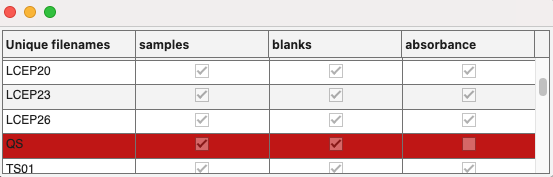

# alignsamples
Compare sample names between datasets and remove the unmatched samples.

## Syntax

[`dsout1, __, dsoutN = alignsamples(dsin1, __, dsinN)`](#syntax1)

[`alignsamples(dsin1, __, dsinN)`](#syntax2)

## Description

For the correction of inner-filter effects, blank subtractions, and Raman signal calibrations, the involved datasets ***_must_*** be aligned such that each contains the same number of samples of the same sample identity in the same sequence. `alignsamples` ensures this is the case.

`alignsamples` works with the `drEEMdataset` property `filelist` for the comparisons. It is strongly recommended to use the same sample names for different spectroscopic measurements and use filename tags to distinguish between the measurement types, e.g. "sample 01 - sample eem.csv", "sample 01 - blank eem.csv", "sample 01 - absorbance.csv". This might require you to manually copy the same blank to pair it with each sample. The tags would be used by the toolbox to identify the measurement type and will automatically be removed upon import. `alignsamples` can then be called directly and without issues.

If the names between samples, blanks, and absorbance files differs prior to import, make sure to use a metadata table and import it to replace the diverging filenames  with the matching ones. Take a look at the [complex data import tutorial](import_tutorial_02.html) to learn how this can be done.

> ***If no common sample names between the datasets are found, the function will always return an error prior to any console or figure output.***

	
<b>`[dsout1, __, dsoutN] = alignsamples(dsin1, __, dsinN)`</b>
	

 

Match sample names across multiple datasets (`N≥2`) and remove the unmatched samples to ensure that the output datasets contain only the same samples in the same sequence. Number and order of the output should match the input. Console output will be provided as summary, for example:

	samples: removed 1 samples with the previous .i: 10
	blanks: removed 1 samples with the previous .i: 10
	absorbance: No action necessary. All files between supplied datasets had same names.

	
<b>`alignsamples([dsin1, __, dsinN])` - diagnostic mode</b>
	

 

Runs the function in diagnostic mode. Without output arguments, the function will run as always, but no output arguments are assigned. Use this notation for testing. This gives the chance to fix issues with filenames. First, console output will be provided, followed by a table with more information to take action:

	samples: removed 1 samples with the previous .i: 10
	blanks: removed 1 samples with the previous .i: 10
	absorbance: No action necessary. All files between supplied datasets had same names.
The uifigure table shows exactly where sample names matched and didn't match and in which dataset. For example:

## Examples
`alignsamples(samples,blanks,absorbance)`

Diagnose how many sample names match between the datasets. Can be run before the next example to troubleshoot issues.

`[samples,blanks,absorbance] = alignsamples(samples,blanks,absorbance)`

Perform the comparisons of sample names and delete the non-ubiquitous samples in each of the datasets.

## Input arguments

    
<b>`dsin1, __, dsinN `- datasets for comparisons</b>

    <i>drEEMdataset class</i>
        
A dataset of the class `drEEMdataset` that passes the validation function `data.validate(data)`. 

<!---

    
<b>`comment - descriptive text`</b>

    <i>text of the class string or char</i>
     -->   

<!---
## Name-Value arguments
-->
