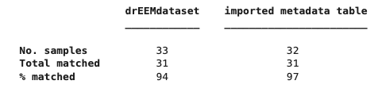

# associatemetadata
Associate a metadata file with a `drEEMdataset`

## Syntax

[`dataout = associatemetadata(data, filename, metadatakey)`](#syntax1)

[`dataout = associatemetadata(data, filename, metadatakey, datakey)`](#syntax2)

[`dataout = associatemetadata(data, metadataTable, metadatakey, datakey)`](#syntax3)

[`associatemetadata(data, filename, metadatakey, datakey)`](#syntax4)

[`associatemetadata(data, metadataTable, metadatakey, datakey)`](#syntax4)

## Description

Metadata that describes samples is helpful in describing dynamics between samples. The drEEM toolbox supports metadata via the drEEMdataset property `metadata`, which is a table that can store information such as location, date / time, analyst, salinity, temperature, ... .

The function ensures that the identifiers in both the `data` and the metadata exist, are of the same class and are unique, then performs necessary type conversions to limit the associated data to be of type `char`, `double`, or `categorical`. The `metadata` field entries for the unmatched samples  are filled with `missing` or `NaN` values.
If no output argument is specified, the function overwrites the original object in the workspace.

Metadata are stored in `data.metadata`. To access and extract,  `md=data.metadata` would extract the metadata from the dataset and create a table in the workspace.

> **Note:** `associatemetadata` will always provide basic output on the associations made between tables and the dataset. This is done with console output:
> 
> 

Always inspect the outcome.

Many functions support content in the metadata table and will offer to enrich plots by referring to the contents.

    
<b>`dataout = associatemetadata(data, filename, metadatakey)`- default options</b>

    

The `associatemetadata` function reads metadata information from a  file or table specified by `filename` and associates it with `data` based on specified key in metadata table pointed at with `metadatakey`. The function by default uses `filelist` field in `data` as identifier key for `drEEMdataset`.

<b>`dataout = associatemetadata(data, filename, metadatakey, datakey)`- different dataset key</b>

`datakey` points to a variable in the metadata table that will be used for the association of the external table with the `drEEMdataset` (instead of the property `filelist`).

<b>`dataout = associatemetadata(data, metadataTable, metadatakey)`- provide table variable</b>

`metadataTable` is a variable of the class table that exists in the workspace. This can be useful if a table needed modification prior to associating it with the metadata table. The default syntax with `filename` will make `associatemetadata` load the table itself, whereas providing `metadataTable` will assume that a table is handed to the function.

<b>`associatemetadata(data, metadataTable, metadatakey)`- diagnostic mode</b>

Also `associatemetadata(data, metadataTable, metadatakey, datakey)`

With this syntax (by providing no output arguments), the function runs in diagnostic mode. It will simply return statistics on how many of the table rows and drEEMdataset variables have been associated sucessfully. If the number is lower than expected, you should investigate, fix the issues, and re-run the function.

## Examples

`samples = associatemetadata(samples,tbl,'sampleID')`

Read metadata from the loaded `tbl` and use sampleID column in the `tbl`as the `metadatakey`.  

`samples = associatemetadata(samples,"c:\data\metadata.xlsx",'sampleID')` 

Read metadata from the path specified in `filename` and  use sampleID column in the metadata file as the `metadatakey`.

## Input arguments

    
<b>`data` - dataset to include metadata in</b>

    <i>drEEMdataset</i>
        
A dataset of the class `drEEMdataset` that passes the validation function `tbx.validatedataset(data)`. 

<b>`filename` - name of variable or table</b>

    <i>char | string | table</i>

If a `table`, it should be a metadata table already loaded into MATLAB workspace. The `table` should contain a column header as specified by `metadatakey`.
If a `string` or `character array`, it should be a path to a file containing the metadata. For local files, `filename` can be a full path that contains a filename and file extension. FILENAME can also be a relative path to the current folder, or to a folder on the MATLAB path.
The following extensions are supported: `.txt`, `.dat`, `.csv`, `.log`,`.text`, `.dlm`, `.xls`, `.xlsx`, `.xlsb`, `.xlsm`, `.xltm`, `.xltx`, `.ods`.

    
<b>`metadatakey` - identifier key in metadata</b>

    <i>char | string</i>
        
The name of the column in the metadata table that contains the identifiers to match with `data`.

## Optional input arguments

    
<b>`datakey` - identifier key in data</b>

    <i>char | string</i>
        
The name of the field in the `data` object that contains the identifiers to match with the metadata.
Default: `filelist`

## Output arguments

    
<b>`dataout` - dataset with new columns in metadata table</b>

    <i>drEEMdataset</i>
        
A dataset of the class `drEEMdataset` that passes the validation function `tbx.validatedataset(dataout)`. 

