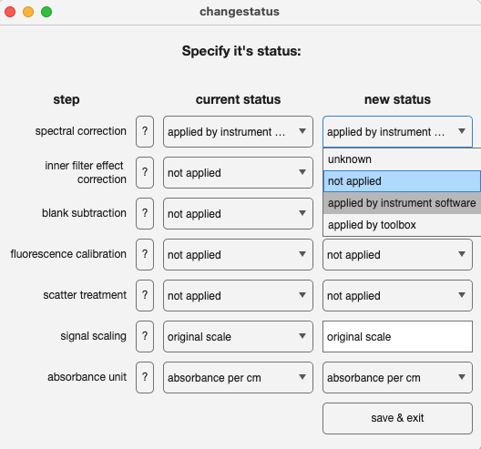

# changestatus
Manually change the status of a `drEEMdataset` to reflect its current state

## Syntax

`data=changestatus(data)`

## Description
The `changestatus` function opens up a user interface that allows to change the status of the data in one or more of the available fields. The fields describe:

- spectral correction
- inner filter effect correction
- blank subtraction
- signal calibration
- scatter treatment
- signal scaling
- absorbance unit

> The property `status` of `drEEMdataset` is a read-only property that can only be changed by methods of the toolbox. This includes `changestatus`, but also all other processing functions, such as `subtractblanks`.

The function offers guidance on each aspect of the status. This can be accessed by pressing the "?" button next to the name of the status in the interface.

## Examples

`data=changestatus(data)`

`changestatus` is a GUI tool. Calling the function will result in a uifigure and Matlab waits for the GUI to close. This is done by hitting the button "save & exit".

The function offers guidance on each aspect of the status. This can be accessed by pressing the "?" button next to the name of the status in the interface.

## Input arguments

    
<b>`data` - dataset in need of status update</b>

    <i>drEEMdataset</i>
        
A dataset of the class `drEEMdataset` that passes the validation function `data.validate(data)`. 

<!---
## Name-Value arguments
-->
