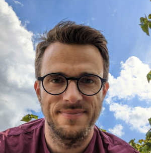

# drEEM toolbox for MATLAB
This toolbox that aids the multiway decomposition of fluorescence EEMs into underlying fluorescence components using PARAFAC.

## About this documentation and version 2
This documentation is intended to ease the use of the toolbox and will walk you through the installation and usage of the toolbox and its functions. Most importantly, we provide a number of tutorials that should allow new users and those not experienced in the programming environment to get started.

Since the initial release of drEEM in 2013, Matlab has expanded considerably in terms of ease-of-use, functionality, and computation speed. drEEM version 2 takes advantage of new Matlab features and is a complete redevelopment of the code.

 <iframe width="80%" height="400" allowfullscreen="true"
src="https://www.youtube.com/embed/9OyxSKEWmbE?autoplay=1&mute=1">
</iframe>

## About the developers
### Urban Wünsch

Urban is a researcher in the field of aquatic environmental chemistry. He has obtained his PhD at the Technical University of Denmark (DTU) in 2018 and since held postdoctoral positions at Chalmers University of Technology and DTU. He is a teacher in the reocuring online workshop [Parallel Factor Analysis for DOM fluorescence](https://dreem.gitlab.io/coursepage/). Read more on his [personal website](https://ujwunsch.com).

Urban is the main developer of the toolbox.

### Kathleen Murphy

Kate’s research focuses on the interpretation of fluorescence from dissolved organic matter in natural waters and the application of fluorescence for distinguishing between water sources and detecting changes in water quality. Recent research projects relate to detecting changes in organic matter character during recycled and drinking water treatment, and tracing the geographical origin of ships’ ballast water. She has instigated several open-source projects aimed at improving the modelling and interpretation of natural organic matter fluorescence, including the drEEM toolbox and the online database of fluorescence spectra OpenFluor.

Kate is a Associate Professor at Chalmers University of Technology (Gothenburg, Sweden).

### Ali Esmaeeli
Ali is an environmental engineer with a focus on developing methods and sensors for water treatability/quality prediction. Ali's research group aim at using fluorescence technology to get a better understanding of water characteristics which could later be used in online and real-time sensors that are not currently available. Ali's main supervisor in this path is Dr. Kathleen Murphy, who carries more than twenty years of knowledge in this area. The outcome of Ali's research study can benefit a whole variety of different sectors at various levels. For example, by applying it in a treatment plant, one can produce cleaner water, using less resources, which in turn will help people, society as a whole, and the environment.
### Rasmus Bro

Rasmus Bro is performing research on most aspect of machine learning and artificial intelligence within analytical chemistry (chemometrics). He is heading an industrial research consortium, ODIN, focusing on Process Analytical Technology (PAT) . He has been an editor of Journal of Chemometrics for many years and is the author of a number of matlab toolboxes that are made freely available.

For the toolbox, Rasmus develops new methods for performing machine learning.