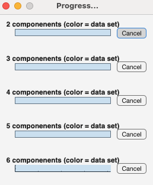

# dataout
Fit PARAFAC models to fluorescence data.

## Syntax

[`dataout = dataout(data)`](#syntax1)

[`dataout = fitparafac(___ , Name,Value)`](#syntax2)

## Description

The `fitparafac` function performs Parallel Factor Analysis (PARAFAC) on the provided `data`. The models are saved in `data.models`. The function supports various configurations, including different constraints, convergence criteria, initialization methods, and etc.
The function supports parallelization performance-optimization, but the parallel computing toolbox is required. The function uses default values of input arguments (see Input arguments section) when options are not specified.
An entry will be added to the `history` field of the `data`, detailing the  options used for `fitparafac`. 

    
<b>`dataout = fitparafac(data)` - default options</b>

    
        

The function supports fitting models with default options. However, these are conservative in nature with low convergence and many consecutive starts with random numbers. The defaults are:

* fitting 2-7 component models
* nonnegativity constraints in all modes
* 40 starts (5*40 = 200 model initializations with one call)
* convergence when relative change between iterations is smaller or equal to 1e-8
* Model initialization with random numbers
* Parallelization is active and console output is kept to a minimum
* The default PARAFAC engine is "parafac3w", an optimization of PARAFAC that is approx. 5x faster than N-way toolbox PARAFAC, but only supports nonnegative models.

You might like some of these settings, and want to change others. Do so by using the Name,Value notation for options (see below).

    
<b>`dataout = fitparafac( ___ , Name,Value)` - [Name,Value](#NameValue) arguments</b>

    

Most often, the default options will not suffice or do the trick. Custom options can be speficied using one or more [Name,Value](#NameValue) pair arguments. For example, you can specify the number of components for models, constraints, initialization and parallelization options. For example, `f=2:6` specifies that only 2-6 component models should be fit, `starts=2` that only two initializations should be initiated per model. See [Name,Value](#NameValue) for all options.

> **Info:** Even with parallelization and optimized algorithms, the function might take a long time to finish. If you wish to abort, please use the "cancel" button next to the waitbar for each model. The function will attempt to finish, but might return an error if no usable models have been found. Note that this option is only available when `parallelization=true`. For conventional execution, `Ctrl+c` will abort the execution.
> 

## Examples

`samples=tbx.fitparafac(samples,f=2:7,convergence=1e-4,starts=2);`
Fit models similar to the previous **outliertest**

`samples=tbx.fitparafac(samples,f=4:6,convergence=1e-8,starts=50,maxIteration=5000);  `
Find the **global minimum** for a dataset

`samples=tbx.fitparafac(samples,f=2:7,constraints="unconstrained",convergence=1e-6,starts=10,maxIteration=5000);`
Explore what happens with **no constraints**

`samples=tbx.fitparafac(samples,f=2:7,mode="split",convergence=1e-8,starts=50,maxIteration=5000);`
Equivalent to the **former splitanalysis**
   

## Input arguments

    
<b>`data`- contains EEMs to fit models to</b>

    <i>drEEMdataset</i>
        
A dataset of the class `drEEMdataset` that passes the validation function `tbx.validatedataset(data)`. 

## Name-Value arguments
Specify pairs of arguments as `Name1=Value1,...,NameN=ValueN`, where `Name` is the argument name and `Value` is the corresponding value. The notation `"Name",Value` is also supported. Name-value arguments must appear after other arguments, `data` in this case, but the order of the pairs does not matter. 

    
<b>`f`- the number of components</b>

    <i>numeric</i>

Numeric array specifying the number of components to use in the PARAFAC  models. Default is `[2, 3, 4, 5, 6, 7]`. Can be specified as array, e.g. `2:6` for simplicity.

    
<b>`mode` - fit models to the overall dataset or splits</b>

    <i>string | char</i>

A text specifying the mode of operation. Can be set to `"overall"` for analyzing the whole dataset in `data` (default) or `"split"` for analyzing subsets of the data obtained from `data.splits`. Subsets of `data` should be previously created using `splitdataset` function. Default is `"overall"`.

    
<b>`constraints` - force PARAFAC to adhere to rules</b>

    <i>string | char</i>

Specify the constraints to apply to the models. You can choose from:  

- `"unconstrained"`: there are no restrictions on the values that the elements of the factor matrices can take. They can be positive, negative, or zero. While this option provides greater flexibility in fitting the data, the resulting factors might be harder to interpret, especially where negative values do not make sense (e.g., physical quantities like concentrations or intensities). 

- `"nonnegativity"`: Nonnegativity constraints ensure that all the elements in the factor matrices are greater than or equal to zero.
This option can sometimes make it harder to achieve the best possible fit to the data because the model is less flexible but is particularly useful in where the factors represent quantities that cannot be negative.
- `"unimodnonneg"`:T his constraint ensures that the factor matrices are both nonnegative and unimodal. A factor is unimodal if it has a single peak or mode, meaning it increases to a maximum value and then decreases. This constraint can help in obtaining more realistic and interpretable factors, while, meantime, making it more challenging to achieve the best fit to the data. 
 
Default constraint is `"nonnegativity"`.

    
<b>`starts` - number of initializations per model</b>

    <i>numeric</i>

Number of random starts for the algorithm refers to initializing the factor matrices with random values and running the algorithm multiple times. Default is `40`.

    
<b>`convergence` - stop criterion</b>

    <i>numeric</i>

If the relative change in model fit between iterations falls below a `convergence` threshold, the algorithm is considered to have converged and will stop running. Default is `1e-8`. Preliminary models can be run with `1e-6` or `1e-4`.

    
<b>`maxIteration` - stop criterion</b>

    <i>numeric</i>

Specify the maximum number of iterations for the algorithm. If the convergence criteria, `convergence`, is not met before the specified maximum number of iteration the algorithm will stop running.
Default is `3000` iterations. The lower `convergence`, the higher `maxIteration` should be set.

    
<b>`initialization` - first guess method</b>

    <i>string | char</i>

Specify the method used to set the starting values for the factor matrices. You can choose from:

- `"random"`: Factor matrices are initialized with random values.
- `"svd"`: Factor matrices are initialized using Singular Value Decomposition (SVD) often leading to faster convergence compared to random initialization. SVD computation can be expensive for very large datasets.
- `"multiplesmall"`: multiple small-scale models are fitted first, and their results are combined to initialize the full-scale factor matrices.

Default initialization method is `"random"`.

    
<b>`parallelization` - explicitly control parallelization</b>

    <i>logical</i>

Enable or disable parallelization. If enabled can dramatically decrease the time required for the analysis. Default is `true`.

Use the option for explicit control of parallelization. Some installations have persistent issues with pool initialization and it might be easier to turn off the feature even if it is theoretically available.

    
<b>`consoleoutput` - level of console output</b>

    <i> string  | char</i>

Specify the level of console output during execution. You can choose from:

- `"all"`: displays all the information during the process. 
- `"minimum"`: minimizes the level of displayed information to only highly important ones.
- `"none"`: does not display anything on the console.

Default is `"minimum"`.

    
<b>`toolbox` - PARAFAC algorithm</b>

    <i> string  | char</i>

Specify the toolbox to use for the PARAFAC algorithm. You can choose from:

- `"parafac3w"`
- `"nway"`
- `"pls"`: Note:  PLS_toolbox must be installed. Warning, recent versions of this software have not been tested for functionality with drEEM.
 
 
Default is `"parafac3w"`.

## Output arguments

    
<b>`dataout` - dataset with PARAFAC models</b>

    <i>drEEMdataset</i>
        
A dataset of the class `drEEMdataset` that passes the validation function `tbx.validatedataset(dataout)`.

Models are stored in dataout.models. Each model is a `drEEMmodel` object contains the following information (no contents in this case):

	drEEMmodel

	ans = 

	  drEEMmodel with properties:

                    loads: {[]  []  []}
                leverages: {[]  []  []}
                      sse: {[]  []  []}
                   status: ""
         percentExplained: NaN
                    error: NaN
                     core: NaN
       percentUnconverged: NaN
    componentContribution: NaN
           initialization: ""
                   starts: NaN
              convergence: NaN
              constraints: ""
                  toolbox: ""

