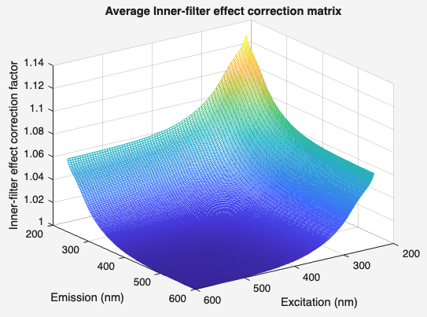

# ifecorrection
Correct the inner filter effects using the absorbance-based approach.

## Syntax

[`dataout = ifecorrection(data,Name,Value)`](#syntax1)

[`ifecorrection(data,Name,Value)`](#syntax2)

## Description

    
<b>`dataout = ifecorrection(data,Name,Value)` - apply IFE correction</b>

 

Applies an inner filter effect correction on fluorescence EEMs in a dataset. `ifecorrection` implements Absorbance (ABA) Method for correcting fluorescence inner filter effects. The method assumes that EEMs and Absorbance were measured in a square cuvette of a pathlength of 10mm (1cm) with standard right-angle geometry.

Additional settings can be changed with the [name-value](#NameValue) pair notation.

> Reference: Parker, C. A.; Barnes, W. J., Some experiments with spectrofluorimeters and filter fluorimeters. Analyst 1957, 82, 606-618.

A inner-filter effect correction matrix will be calculated for every sample. For inspection purposes, the function will show the average correction matrix:

`ifecorrection` only works on the part of the EEMs in `data` that is covered by absorbance data. In case the `absWave` range is shorter than the EEM range (`Ex` and `Em` in `data`), a message is displayed/will be stored in `history` informing the user of this, but the correction will be carried out on a subset of `data` that have matching EEM and absorbance wavelengths. 

Samples with high absorbance (>2) will be identified and these areas will be set to NaN and will not be used for the correction. A warning for this will be displayed.

An entry will be added to the `history` field of the `data`, detailing the processing options used.

>***The status-property "IFEcorrection" must be "not applied". Otherwise, the function returns a validation error. This property changes upon completion of the function to "applied by toolbox".***

    
<b>`ifecorrection(data)` - diagnostic mode</b>

By not supplying an output argument, the function will run in diagnostic mode. IFEs will be calculated and the average IFE will be shown, but the IFE correction will not be applied to the dataset.
    

## Input arguments ##

    
<b>`data` - dataset with fluorescence and absorbance data</b>

    <i>drEEMdataset</i>
        
A dataset of the class `drEEMdataset` that passes the validation function `data.validate(data)`. 

> The property `data.status.signalCalibration` must be `"not applied"`. Otherwise, the function returns a validation error.

## Name-Value arguments
Specify pairs of arguments as `Name1=Value1,...,NameN=ValueN`, where `Name` is the argument name and `Value` is the corresponding value. The notation `"Name",Value` is also supported. Name-value arguments must appear after other arguments, `data` in this case, but the order of the pairs does not matter. 

    
<b>`plot`- switch to plot the results</b>

    <i>logical</i>

Logical or numeric value to specify if a plot showing the results should be generated. The plot shows an overview of slopes for all sample in `data`. If no output argument is supplied, plotting is enabled automatically.

Default is `true`.

## Output arguments

    
<b>`dataout` - IFE corrected dataset</b>

    <i>drEEMdataset</i>
        
A dataset of the class `drEEMdataset` that passes the validation function `data.validate(data)`.

The status of the dataset is changed to reflect the fact that an IFE correction has been applied by the drEEM toolbox.

