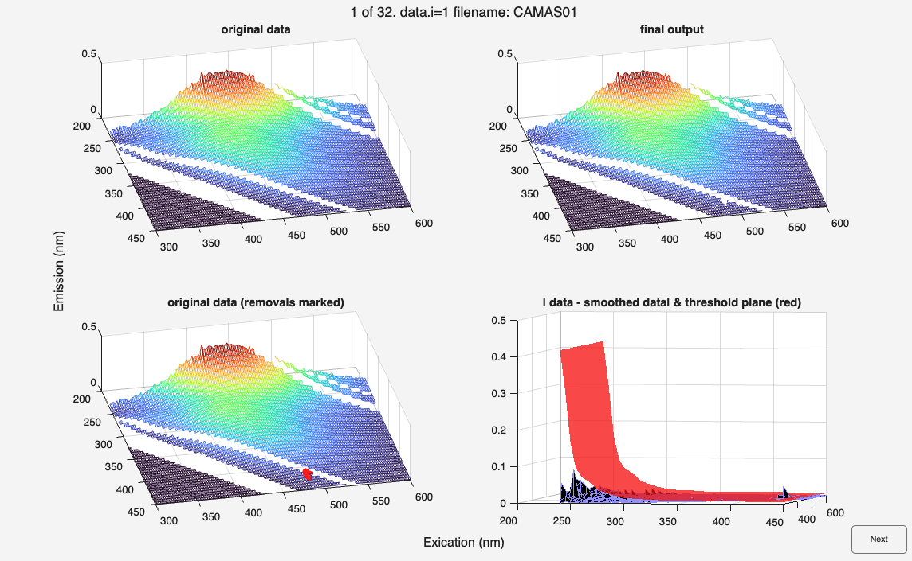

# rmspikes
Removes spikes from fluorescence excitation-emission matrix (EEM) data by identifying and interpolating over noisy data points.

## Syntax
[`dataout = rmspikes(data)`](#syntax1)

[`dataout = rmspikes( ___ , Name,Value)`](#syntax2)

[`rmspikes( ___ , Name,Value)`](#syntax3)

## Description

In large datasets, the quality inspection of every EEM can take a long time. `rmspikes` offers an automated method to delete signal spikes from fluorescence EEMs. It is designed to take out very bad cases of signals that stick out from otherwise smooth EEMs.

> ***The function only works reliably with EEMs that don't contain Rayleigh or Raman Scatter! If scatter is present, the default threshold factor is most likely unusable.***

`rmspikes` performs an analysis that estimates the baseline noise level across the dataset. The analysis sequence is as follows:

* The dataset is replicated four times. In each copy, every 2nd excitation or emission scan is NaN'ed. Once starting at the first, then at the second scan.
* The missing data in each copy is replaced with a 2D-inpaiting algorithm ([`inpaint_nans`](https://www.mathworks.com/matlabcentral/fileexchange/4551-inpaint_nans)).
* The difference between the original and interpolated EEMs is calculated for each copy. The differences are accumulated in one 3D array.
* A threshold matrix is calculated based on the median difference between observed and interpolated. Since data tends to get noisier toward the UV in the excitation direction, the noise floor estimate is transformed into a vector along the excitation direction (noise along the emission is thus assumed to not change with wavelength). The vector is transformed by multiplication with the square root to make the method more sensitive in the UV. The vector is then transformed back into a matrix with `repmat`. `thresholdFactor` is multiplied onto this matrix to saveguard against excessive flagging.
* For points in the EEM where the difference between interpolated and observed data exceeds the threshold matrix, the data is NaN'ed
* If interpolation is enabled, the removed data is finally replaced with a 2D interpolation guess.

> The function works best for wide peaks in the visible range. In testing, the function has shown to have a tendency toward removing parts of narrow peak data in the UV if highly dynamic peaks are present. If this is observed, raise the `thresholdFactor` option or consider refraining from using the function.

Another warning:
> If the dataset contains EEM parts that contain only missing data or zeros, the estimation of the noise floor will fail and the function will return an error. Please use subdataset to trim your dataset to a sensible spectral range in this case!

The function provides warnings if a significant portion of the data is identified as noisy.

Copyright notice:
>**'inpaint'** John D'Errico (2025). `inpaint_nans` (https://www.mathworks.com/matlabcentral/fileexchange/4551-inpaint_nans), MATLAB Central File Exchange. Retrieved March 5, 2025. 

    
<b>`dataout = rmspikes(data)` - default options</b>

Applies the default settings with a threshold factor of 10 and disabled interpolation.

    
<b>`dataout = rmspikes( ___ , Name,Value)` - custom options</b>

specifies additional options using one or more [name-value](#NameValue) pair arguments. For example, you can specify if `interpoaltion` should be performed or adjust the `thresholdFactor`.

    
<b>`rmspikes(data,Name,Value)` - diagnostics mode</b>

When no output argument is supplied, the function automatically switches to diagnostics mode. This automatically sets `plot=true` and `details=true` and facilitates finetuning of `thresholdFactor`.

This example figures show the diagnostic plot (`details=true`) that can help to decide on the most appropriate `thresholdFactor`

## Examples

1. Delete signals 10x above the noise floor and don't interpolate
`samples = tbx.rmspikes(samples);`

2. Finetune thresholdFactor through visual inspection
`tbx.rmspikes(samples,thresholdFactor=15);`

3. Delete signals 20x above the noise floor and interpolate over deletions
`samples = tbx.rmspikes(samples,thresholdFactor=20,interpolate=true);`

## Input arguments ##

    
<b>`data` - dataset with fluorescence data.</b>

    <i>drEEMdataset</i>
        
A dataset of the class `drEEMdataset` that passes the validation function `data.validate(data)`. 

## Name-Value arguments
Specify pairs of arguments as `Name1=Value1,...,NameN=ValueN`, where `Name` is the argument name and `Value` is the corresponding value. The notation `"Name",Value` is also supported. Name-value arguments must appear after other arguments, `data` in this case, but the order of the pairs does not matter. 

    
<b>`thresholdFactor `- sensitivity to excessive noise (sample by sample)</b>

    <i>numeric</i>

Adjust the sensitivity of the spike detection. A lower values means more sensitivity. 

Default is `10`. 

 

    
<b>`interpolate `- switch to enable interpolation</b>

    <i>logical</i>

Logical or numeric value to specify if interpolation over removed data points should be performed. 

Default is `false`.

 

    
<b>`plot`- switch to plot the results</b>

    <i>logical</i>

Logical or numeric value to specify if a plot showing the results should be generated. The plot shows noise threshold profile along excitation mode and the percentage removal of data in excitation and emission modes.

Default is `true`.

    
<b>`details `- switch to enable diangostics plots (sample by sample)</b>

    <i>logical</i>

detailed diagnostic plots each sample. This plot depicts original and final EEMs, original EEM with marked removal points and, finally, the difference between original data and smoothed data.

Use this option to finetune `thresholdFactor`

Default is `false`.

## Output arguments

    
<b>`dataout` - despiked fluorescence data</b>

    <i>drEEMdataset</i>
        
A dataset of the class `drEEMdataset` that passes the validation function `data.validate(data)`.

