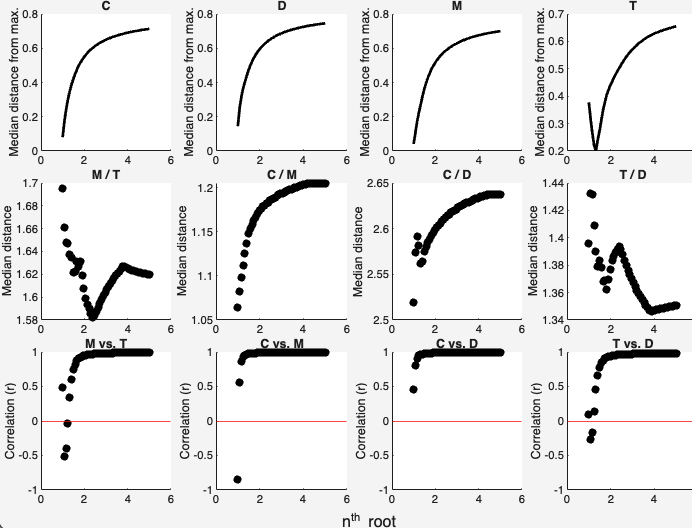

# scalesamples #
Scale fluorescence signals to focus on qualitative difference and (potentially) lessen autocorrelation.

## Syntax

[`dataout = scalesamples(data, option)`](#syntax1)

[`dataout = scalesamples(data, 'reverse')`](#syntax3)

[`scalesamples(data, 'help')`](#syntax2)

## Description ##

In many datasets, the differences between fluorescence signals are not qualitative but quantitative. Since highly correlated signals can violate the variability assumption behind PARAFAC, a method to scale the signals is needed to remove quantitative differences between samples and instead focus on qualitative differences.

In previous versions of the drEEM toolbox, the function to accomplish this was `normeem`. This function scaled each EEM by division with its standard deviation. However, in datasets with steep gradients, this can lead to a situation where smooth EEMs with good signals receive the same weighting as very noisy samples that might even appear highly similar to a blank. The PARAFAC algorithm is then forced to give the same weight to noise as it gives to smooth, well measured signals.

`scalesamples` provides more flexibility to perform scaling. It does so by scaling with the nth root of the standard deviation. The user specifies which nth root should be used. The lowest number (1) equals the scaling of the predecessor `normeem`. The higher the number, the less severe the scaling. In testing, values between 1.2 and 2 have proven useful.

<b>`dataout = scalesamples(data, option)` - apply scaling</b>

 
 
 This syntax is used to apply the scaling. The number provided in `option` represents the `n` of the `nth root` of the standard deviation. n is limited to be between 1 (most severe scaling) and 50 (least severe scaling). If 1, all samples essentially have the same numeric weight, whereas differences between signal magnitutes are maintained at higher numbers (though lessened).
 
The function adds an entry to the dataset's history where the unscaled data is stored. The status of the dataset is changed to inform the user that the data has been scaled. When the function is called again, the original data will be restored to avoid repeated scaling.

> ***Any calls to `subdataset` or `zapnoise` will search for the unscaled, original data and make sure that changes are reflected in the original dataset. The toolbox does so automatically, no need to keep track.***
 

 

<b>`scalesamples(data, 'help')` - decision support</b>

 
 
 In this syntax, the function provides decision support. Peaks C, D, M, and T are extracted for scaled versions of the dataset with `n` between 1 and 5 (n in the nth root).
 
 > ***No output argument is produced with this syntax. If one is provided, an error will occur.***
 
 
 
**The first row** shows the median distance of each peak from the maximum peak intensity in the dataset. Numbers generally increase with increasing `n`, but not always monotonically.	
 
**The second row** shows the median distance between peak pairs M and T, C and M, C and D, and T and D.
 
**The last row** shows correlations between the intensities of peak pairs M vs. T, C vs. M, C vs. D and T vs. D. Here, less autocorrelation is generally desirable but trends differ between peak pairs. Autocorrelations tend to be higher at higher nth roots and hit a minimum at lower numbers.
 

<b>`dataout = scalesamples(data, 'reverse')` - reverse the scaling operation</b>

 
 
 This syntax reverses the scaling operation and restores the original fluorescence EEMs.
 

## Examples

1. normeem equivalent (unit variance scaling)
`samples = tbx.scalesamples(samples,1);`

2. gentle scaling  (Pareto scaling, sqrt of std)
`samples = tbx.scalesamples(samples);`

3. very gentle scaling  (5th root of std)
`samples = tbx.scalesamples(samples,5);`

4. reverse scaling after it had been applied
`samples = tbx.scalesamples(samples,'reverse');`

5. Don't know what to do? Get decision help
`samples = tbx.scalesamples(samples,'help');`

## Input arguments ##

    
<b>`data` - dataset containing EEMs to be scaled.</b>

    <i>drEEMdataset</i>
        
A dataset of the class `drEEMdataset` that passes the validation function `data.validate(data)`. 

> If the status property `data.status.signalScaling` is not `"original scale"`, the function automatically searches the original dataset and does not repeat scaling on scaled EEMs.

    
<b>`option` - specify function operation.</b>

    <i>numeric | character</i>

If a numeric value, it must be a positive number less than or equal to `50`, indicating the scaling intensity. The function scales the data based on the standard deviation of the samples, using the `option` as the root value.

If a character vector, it must be either `'reverse'` to reverse the scaling process and obtain the unscaled data or `'help'` to provide help information. `help` will show a diagnosis plot that depicts the peak distributions (for Peaks C, D, M, and T) for different normalization parameters.

Default is `2`.

## Output arguments (optional)##

    
<b>`data` - dataset containing scaled or original (restored) EEMs.</b>

    <i>drEEMdataset</i>
        
A dataset of the class `drEEMdataset` that passes the validation function `data.validate(data)`. 

> If the status property `data.status.signalScaling` follows any changes made by the function.

