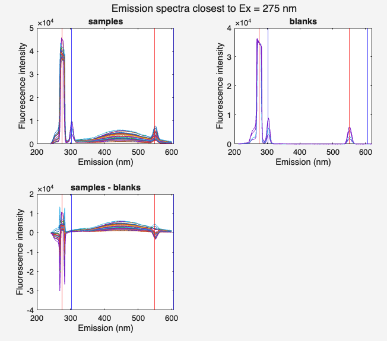

# subtractblanks #
subtract blanks from the samples

## Syntax
[`dataout = subtractblanks(samples, blanks)`](#syntax1)

## Description ##

[dataout](#varargout) = subtractblanks([samples, blanks](#varargin)) 

Subtracts EEMs of blank stored in `blanks` from EEMs stored in `samples`.
The function `subtractblanks` makes sure the `blanks` and `samples`  have the same wavelengths, as this can be the case, especially,
after the `ifecorrection` function has been applied on `samples` and some parts are deleted due to lacking absorbance coverage. `subtractblanks` makes sure that the `blanks` will also be cut to be compatible.

Next, if the subtraction was successful, the function will plot the EEMs stored in `samples`, `blanks`, and `dataout` at an excitation of 275, where protein-like and humic-like fluorescence signal is likely to be observed, for the user to check the performance of the subtraction.

All plots above show the predicted position of the different types of scatter. Take care that predictiona and observation match, otherwise an issue with the wavelength accuracy might exist.

Observe that the area between 1st and 2nd order scatter in the top right corner is flat, otherwise your blanks contain significant levels of fluorescence.

If the last plot (bottom left) contains negative signals, more scatter was observed in the blank relative to the sample. This could be due to small air bubbles in one of the two samples, but is not necessarily a concerning observation.

> ***Always inspect the results of the blank subtraction and pay close attention to potential issues.***

An entry will be added to the `history` field of the `dataout`. If no output argument is specified, the function will overwrite the original `samples` in the workspace.

## Input arguments

    
<b>`samples` - dataset with sample fluorescence</b>

    <i>drEEMdataset</i>
        
A dataset of the class `drEEMdataset` that passes the validation function `data.validate(data)`. 

> The property `samples.status.blankSubtraction` must be `"not applied"`. Otherwise, the function returns a validation error.

    
<b>`blanks` - dataset blank fluorescence</b>

    <i>drEEMdataset</i>
        
A dataset of the class `drEEMdataset` that passes the validation function `data.validate(data)`. 

> The property `blanks.status.blankSubtraction` must be `"not applied"`. Otherwise, the function returns a validation error.

## Output arguments

    
<b>`dataout` - processed dataset </b>

    <i>drEEMdataset</i>
        
A dataset of the class `drEEMdataset` that passes the validation function `data.validate(data)`. 

> The property `samples.status.blankSubtraction` will have changed from `"not applied"` to `"applied by toolbox"`.

