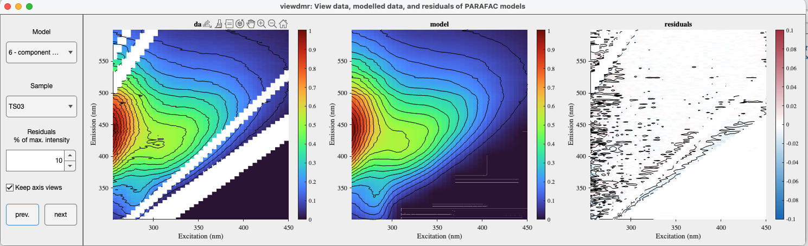

# viewdmr
Visualize the raw data, modeled data, and residual EEM plots for every sample in each parafac model.

## Syntax
[`viewdmr(data)`](#syntax1)

## Description ##

The app visualizes the EEMs of raw data (unmodeled data), modeled data, and the residuals of a specified sample and a PARAFAC model. You can go through different models and samples using the `Model` and `Sample` drop-down menus, respectively. 

You can also navigate through sample using the `prev.` and `next` buttons. Moving through samples will automatically reset the axis view, unless specified otherwise using the `Keep axis view` checkbox.

To adjust the upper limit of the Residual plot's colorbar, use the `% of max. intensity` input box. Maximum intensity refers to the upper limit of the data or model plots' colorbar.

An example of the `viewdmr` GUI

## Input arguments ##

    
<b>`data` - dataset containing PARAFAC models</b>

    <i>drEEMdataset</i>
        
A dataset of the class `drEEMdataset` that passes the validation function `data.validate(data)`.

