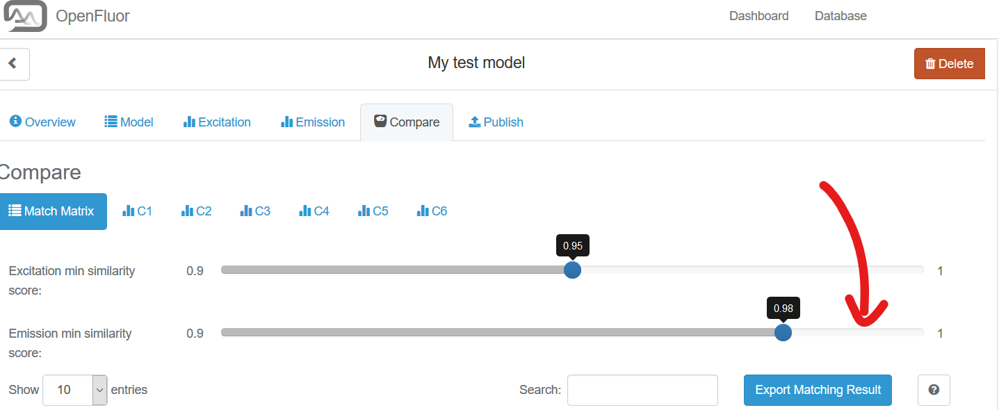
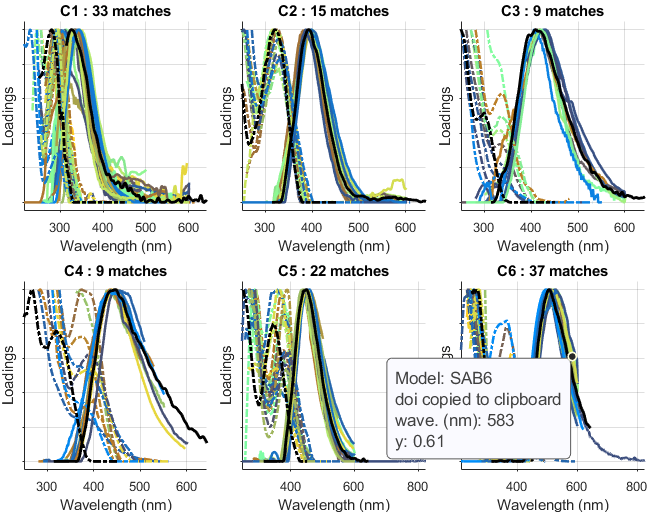

# viewopenfluormatches  #
Plot match results from OpenFluor.

## Syntax

###[[summary](#summary),[M](#M)]=viewopenfluormatches([filename](#filename))##

  Description
-----------
This function lets the user plot OpenFluor database matching results in MATLAB for further inspection, export of graphical output and more.

After importing a model for visual comparison with the entries in OpenFluor ([www.openfluor.org](www.openfluor.org)), the user can choose to export the Matching results:

When calling the downloaded file ("OpenFluorSearch_ModelName_YYYMMDD.csv") with [viewopenfluormatches](viewopenfluormatches.html), the results will be replotted in MATLAB. Note that the datacursor is active and hovering over the loadings plots will reveal additional information about the model that the selected component belongs to:

**Note**: When hovering over any of the components, the datacursor will display additional information & the respective model's DOI is automatically copied to the clipboard. Simply paste into a brower (Windows: `Ctrl+v` and you will arrive at the landing page for most of the models in the database).

  Input Arguments
---------------

**filename** - character array. 

name of the text file to read in, e.g. `'OpenFluorSearch_ModelName_YYYMMDD.csv'`.

  Output Arguments
---------------

**summary** - Table. 

A table containing a list of all match statistics. Model database name and ID, component number, and TCC statistics.

**M** - Structure. 

A dataset structure containing all loadings of the matched models that were plotted.
