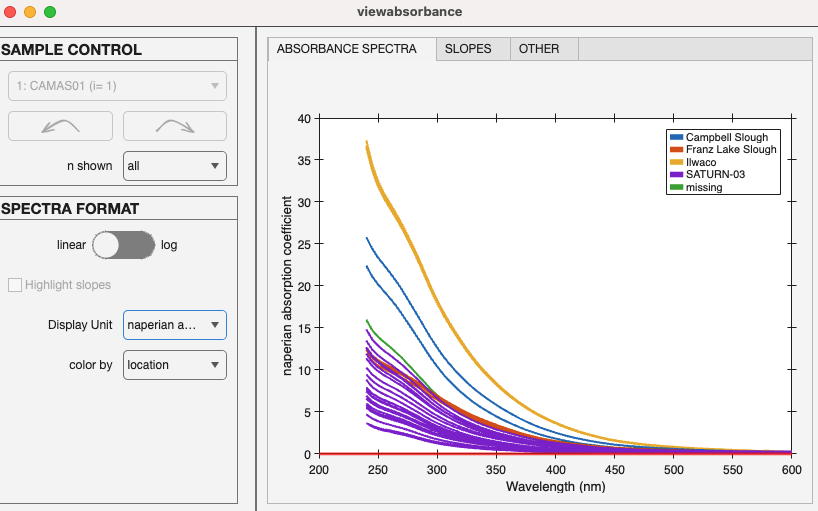
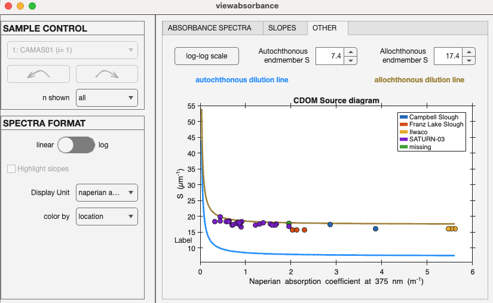

# viewabsorbance
Visualize and analyze CDOM absorbance data.

## Syntax

	viewabsorbance(data)

## Description

Opens up the `viewabsorbance` user interface app. The app allows users to visualize absorbance spectra, switch between displayed absorbance units, and color spectra according to metadata in `data.metadata`.

Spectra can be plotted all at once or on a single sample basis. If a single sample is selected, the spectral area of the different CDOM slopes can be highlighted.

The app automatically calcualtes CDOM slopes during startup and these can be explored when selecting a different tab for visualization. The tab "slopes" shows Box-Whisker plots for each slope.

The "OTHER" tab (above) displays the CDOM source diagram according to [Stedmon et al (2000)](https://doi.org/10.1006/ecss.2000.0645). Two dilution lines for allochthonous and autochthonous material are provided with default values according to the publication and samples are inserted according to their exponential CDOM slope and Naperian absorption coefficient at 375nm. This visualization can be used to assign a dominant punative source for CDOM.

## Input arguments ##

    
<b>`data` - dataset containing  absorbance data</b>

    <i>drEEMdataset</i>
        
A dataset of the class `drEEMdataset` that passes the validation function `tbx.validatedataset(data)`.

